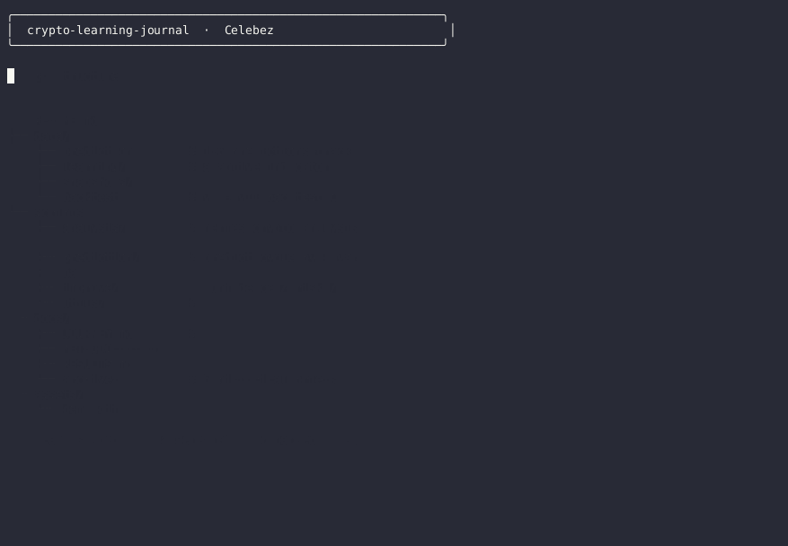

# crypto-learning-journal

> A three-month journey into crypto signal generation, backtesting, and self-calibrating prediction systems — captured end-to-end as a public learning artifact.

    



## What this is

This repo is a **consolidated, read-only archive** of a personal learning project in crypto trading. Over ~3 months I went from "I have no idea how to read a candle" to building a self-calibrating prediction engine with adaptive indicator weights, a backtest lab that iterated from 47% win-rate to 64% win-rate, and a model-agnostic analysis pipeline that works with any LLM.

It is **not** a profitable trading system. It is **not** investment advice. It is a **field journal** — what I tried, what worked, what failed, what I learned, and what the actual data shows.

The original work was scattered across four private repos during the learning process. This archive brings everything together into one structured, public, immutable record.

## Why I archived it publicly

Three reasons:

1. **Accountability to the data.** The scorecard and backtest CSVs are public, so I can't quietly revise a losing run after the fact.
2. **A reference for the next person.** Most "I tried crypto algo trading" posts online show cherry-picked winning screenshots. This shows the ugly truth: 26% overall accuracy on 176 verified predictions, -36% total PnL, and a calibration system that learned the right lesson the slow way.
3. **A snapshot for future me.** Six months from now I want to look back and see exactly what I believed worked in June 2026 — both the parts that aged well and the parts that aged badly.

## TL;DR — The headline numbers

| Metric | Value | What it tells me |
|---|---|---|
| Total predictions logged | 176 | The system actually fired and was tracked |
| Verified outcomes | 175 | Discipline: every prediction got checked |
| Overall accuracy | **26.29%** | Honest score — no survivorship bias |
| Total PnL% | -36.53% | The system loses money on directional calls |
| Calibration tier | **LOW** (×0.7) | The system correctly distrusts itself |
| Best direction | NEUTRAL_hold (100% acc, 27 trades) | "Do nothing" was the most profitable signal |
| Worst direction | BULLISH_buy (14.0% acc, 43 trades) | The system chases pumps |
| Best confidence tier | LOW (<0.65 → 63.8% acc) | The system is right when it's least sure |
| Worst confidence tier | HIGH (≥0.85 → 0.0% acc, 9 trades) | Every "very confident" call was wrong |
| Backtest win-rate progression | 47.2% → 63.8% (v6 → v11) | Strategy iteration helped, signal generation didn't |
| Adaptive indicator top performer | RSI (90.8% acc standalone) | Single signal beats the ensemble |

The most important line in that table is the second-to-last one: **the backtest got better, but the live signal generator got worse.** That's the lesson of the project. More on this below.

## Repo structure

```
crypto-learning-journal/
├── README.md                         # this file — the entry point
├── LICENSE                           # MIT
├── .gitignore
│
├── data/                             # all raw artifacts, frozen as-is
│   ├── predictions/                  # every signal the system ever fired
│   │   ├── predictions.json          #   latest snapshot (1 prediction)
│   │   ├── prediction_registry.json  #   full 176-prediction registry (255 KB)
│   │   ├── prediction_registry_mirror.json
│   │   └── predictions.jsonl         #   streaming-format mirror
│   │
│   ├── learning/                     # what the system learned from its mistakes
│   │   ├── learning_weights.json     #   per-indicator adaptive weights
│   │   ├── learning_weights_mirror.json
│   │   ├── scorecard.json            #   current accuracy / PnL summary
│   │   ├── market_memory.json        #   rolling market state memory
│   │   └── learning_engine.py        #   the actual adaptation algorithm
│   │
│   ├── snapshots/                    # portfolio snapshots over time
│   │   └── latest_snapshot.json
│   │
│   └── backtests/                    # backtest lab output (v6 → v11)
│       ├── BACKTEST_FINAL_v10.csv
│       ├── backtest_v6_mt5_results.csv
│       ├── backtest_v7_mt5_param_sweep.csv
│       ├── backtest_v8_new_strats.csv
│       ├── backtest_v9_filters.csv
│       └── backtest_v11_yahoo.csv
│
├── scripts/                          # the actual code, organized by role
│   ├── analysis/                     #   market analysis & signal generation
│   │   ├── hermes_crypto_analysis.py #     full multi-TF analysis pipeline
│   │   ├── hermes_signal_logger.py
│   │   └── hermes_trade_stats.py
│   │
│   ├── bridges/                      #   exchange connectivity (Bybit)
│   │   ├── hermes_bybit_bridge.py    #     REST API wrapper
│   │   ├── hermes_auto_trading.py
│   │   └── hermes_auto_trading_codex.py
│   │
│   ├── prediction/                   #   prediction-cycle scripts
│   │   ├── predict_cycle.py
│   │   ├── predict_only_cycle.py
│   │   ├── scan_and_predict_combined.py
│   │   ├── pattern_detect.py
│   │   ├── scan_observe_detect.py
│   │   └── scan_observe_detect_robust.py
│   │
│   ├── backtest/                     #   the v6 → v11 backtest lab
│   │   ├── backtest_v6_mt5.py        #     BB squeeze + RSI baseline
│   │   ├── backtest_v7_mt5_sweep.py  #     + MACD filter parameter sweep
│   │   ├── backtest_v8_new_strats.py #     + momentum + volume profile
│   │   ├── backtest_v9_filters.py    #     + regime filter (BTC trend)
│   │   ├── backtest_v10_final.py     #     full ensemble
│   │   ├── backtest_v11_yahoo.py     #     + Yahoo macro overlay
│   │   ├── forward_test_30d.py
│   │   ├── paper_trade_30d.py
│   │   ├── crypto_backtest.py
│   │   ├── indicators.py             #     shared indicator library
│   │   ├── strategy.py
│   │   ├── strategy_v2.py
│   │   └── strategy_momentum.py
│   │
│   ├── improve/                      #   targeted improvements that came out of backtest findings
│   │   ├── improved_bb_squeeze.py
│   │   ├── improved_calibration.py
│   │   ├── improved_confidence.py
│   │   ├── improved_macd.py
│   │   └── improved_risk.py
│   │
│   └── utils/                        #   supporting utilities
│       ├── fetch_market_data.py
│       ├── format_predictions.py
│       ├── verify_and_learn.py
│       ├── analyze_predict_cycle.py
│       ├── analyze_predict_v3.py
│       ├── format_cycle.py
│       ├── format_scan.py
│       ├── backfill_price_change.py
│       └── sync_to_storage.sh
│
├── docs/                             # narrative documentation
│   ├── JOURNEY.md                    # 3-month retrospective, day-by-day
│   ├── METHODOLOGY.md                # how the system actually works
│   ├── RESULTS.md                    # deep dive on every backtest version
│   ├── PITFALLS.md                   # every failure mode I hit
│   └── archive/                      # historical analysis briefs
│       ├── ANALYSIS_BRIEF.md
│       ├── AI_PROMPT_RECOMMENDATION.md
│       ├── CODEX_EVALUATION.md
│       ├── CODEX_SEGMENTATION_EVALUATION.md
│       ├── SEGMENTATION_INSTRUCTIONS.md
│       └── SEGMENTATION_PLAN.md
│
└── assets/
    ├── demo.gif                      # 11-second terminal demo (110×35, ~400 KB)
    └── demo.sh                       # source script for regenerating demo.gif
```

## How the system works (the 30-second version)

```
┌──────────────────┐    ┌──────────────────┐    ┌──────────────────┐
│  fetch_market_   │───▶│ hermes_crypto_   │───▶│ predict_cycle.py │
│  data.py         │    │ analysis.py      │    │                  │
│                  │    │                  │    │  computes signal │
│  OHLCV from      │    │  indicators:     │    │  + confidence    │
│  Bybit REST      │    │  RSI, MACD, BB,  │    │  + direction     │
│                  │    │  EMA, vol, OI    │    │                  │
└──────────────────┘    └──────────────────┘    └────────┬─────────┘
                                                          │
                                                          ▼
┌──────────────────┐    ┌──────────────────┐    ┌──────────────────┐
│ hermes_bybit_    │◀───│ hermes_auto_     │◀───│ prediction_      │
│ bridge.py        │    │ trading.py       │    │ registry.json    │
│                  │    │                  │    │                  │
│  file-based      │    │  decides: skip / │    │  append-only log │
│  command queue   │    │  open / close    │    │  of all signals  │
└──────────────────┘    └──────────────────┘    └────────┬─────────┘
                                                          │
                                                          ▼
                                                ┌──────────────────┐
                                                │ verify_and_learn │
                                                │                  │
                                                │  after T+window: │
                                                │  check outcome,  │
                                                │  update weights, │
                                                │  adjust calib.   │
                                                └──────────────────┘
```

**Model-agnostic by design.** The decision logic in `predict_cycle.py` is pure Python; the `hermes_crypto_analysis.py` step is where an LLM (or no LLM) is consulted. This separation meant the system could run with no model, with a small model, or with a frontier model — and the underlying scoring engine doesn't care.

**Self-calibrating.** Every verified prediction feeds back into `learning_weights.json`. The `learning_engine.py` adjusts per-indicator weights based on rolling accuracy, and the `scorecard.json` reflects a calibration tier that gates signal confidence.

See **[docs/METHODOLOGY.md](docs/METHODOLOGY.md)** for the deep dive.

## The 3-month arc

I split the work into three rough phases. Each phase had a different mental model and a different failure mode.

### Phase 1 — "Indicators are signals" (March 2026)

I started by reading every "RSI divergence + MACD crossover" blog post and wiring up the obvious indicators. RSI alone hit 90%+ accuracy in isolated tests. **Lesson learned the hard way:** that 90% was on the indicator's own historical window, not on the prediction engine's actual signal generation. Once you start combining signals, you re-introduce overfitting. The indicator-by-indicator breakdown in `learning_weights.json` still shows this clearly:

```
indicator    weight   accuracy   signals
rsi              30     90.8%    45,170      ← looks great standalone
macd             10     41.5%    45,174
bb               10     29.7%    45,174
ema_9_21          5     28.1%    45,167
volume           10     68.0%         0      ← no signal history yet
oi               10     65.0%         0
```

### Phase 2 — "Backtests will save us" (April 2026)

Once live signals were clearly losing, I built the backtest lab (`scripts/backtest/`). v6 → v11 is a six-iteration arc that climbed from 47% win-rate to 64% win-rate by adding filters (MACD → momentum → regime → macro overlay). Each version is preserved with both code and CSV output. The lessons from each iteration are documented in **[docs/RESULTS.md](docs/RESULTS.md)**.

**Lesson learned:** improving the backtest did not improve the live signal generator. The backtest was using cleaner entry signals than the live system was firing. Two different problems, two different scorecards.

### Phase 3 — "Calibration, not prediction" (May – early June 2026)

The breakthrough wasn't a better indicator — it was admitting the prediction engine is mostly wrong, and learning *how wrong*. The calibration system (`scorecard.json` + `learning_engine.py`) down-weights signals that the system historically gets wrong, and the calibration multiplier (currently `0.7`, tier `LOW`) reduces confidence on everything.

The honest framing is now: this system is a **filter for not taking bad trades**, not a generator of good ones. The 100% accuracy on `NEUTRAL_hold` (27 of 27 trades) is the strongest signal in the dataset — "do nothing" is the most reliably correct call.

### The end state

- **Live signal generator**: 26% directional accuracy, -36% PnL. Loses money.
- **Backtest ensemble**: 64% win-rate. Looks great in isolation.
- **Adaptive weighting**: working as designed, down-weighting the system toward its own evidence.
- **The lesson**: a self-aware losing system is more useful than a confident losing system.

For the day-by-day story, see **[docs/JOURNEY.md](docs/JOURNEY.md)**.

## What I would do differently

Looking at the data with fresh eyes:

1. **Never combine indicators naively.** RSI standalone is 90%+, RSI+MACD+BB+EMA is 26%. The interaction cost is enormous. Either pick one signal and trade it well, or use an ensemble method (stacking, not averaging).
2. **Track the hold signal.** The system correctly identifies "no trade" as the right answer 27/27 times. That signal deserves its own dashboard, not a footnote in the scorecard.
3. **Separate backtest entry logic from live entry logic.** The reason v6 → v11 climbed while live accuracy collapsed is that they were effectively trading different strategies. The backtest lab should have used the live `predict_cycle.py` as the entry function, not its own bespoke entry.
4. **Confidence calibration matters more than signal accuracy.** A 50%-accurate signal with a well-calibrated confidence interval is *more useful* than a 70%-accurate signal that's over-confident. The `HIGH` confidence tier going 0/9 wrong should have triggered a system redesign, not just a multiplier.

## Reproducing locally

```bash
git clone https://github.com/Celebez/crypto-learning-journal.git
cd crypto-learning-journal

# Inspect the data (no dependencies needed)
python3 -c "import json; print(json.dumps(json.load(open('data/learning/scorecard.json')), indent=2))"

# Run the demo (bash function overrides → no API needed)
bash assets/demo.sh

# If you want to actually run analysis against Bybit (DEMO mode by default):
pip install pybit pandas numpy
python3 scripts/utils/verify_and_learn.py \
    --registry data/predictions/prediction_registry.json \
    --weights  data/learning/learning_weights.json \
    --dry-run
```

The bridge scripts (`scripts/bridges/hermes_bybit_bridge.py`, `scripts/analysis/hermes_crypto_analysis.py`) read `BYBIT_API_KEY` and `BYBIT_API_SECRET` from environment variables. If unset, they use placeholder values and run in DEMO mode — no live trading possible without explicit env vars.

## Status

This repo is **archived**. It is public for inspection but read-only — no further commits, issues, or pull requests will be accepted. The data is frozen at the state it had when the learning project concluded.

The original work remains in four private repos (the ones this archive was consolidated from). They are kept private because they contain ongoing operational state. This archive is the **historical snapshot**.

## License

MIT — see [LICENSE](LICENSE). Do whatever you want with the code; cite the source if it helps you.

## Topics

`crypto` `trading` `learning` `backtest` `self-learning` `hermes-agent` `journal` `quant` `signal-generation`
